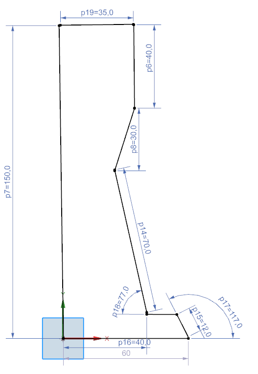
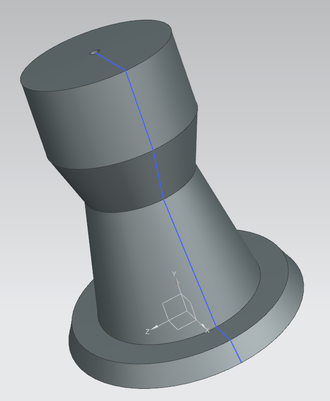
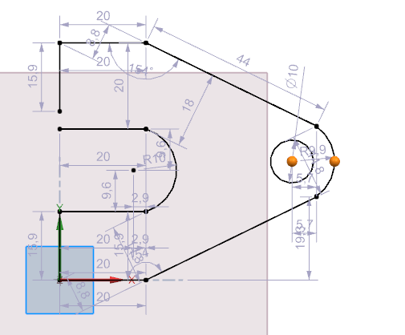
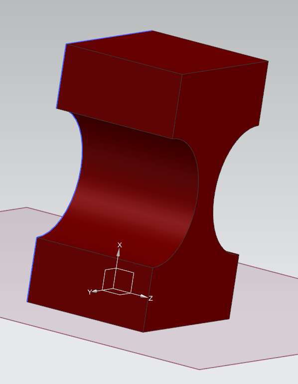
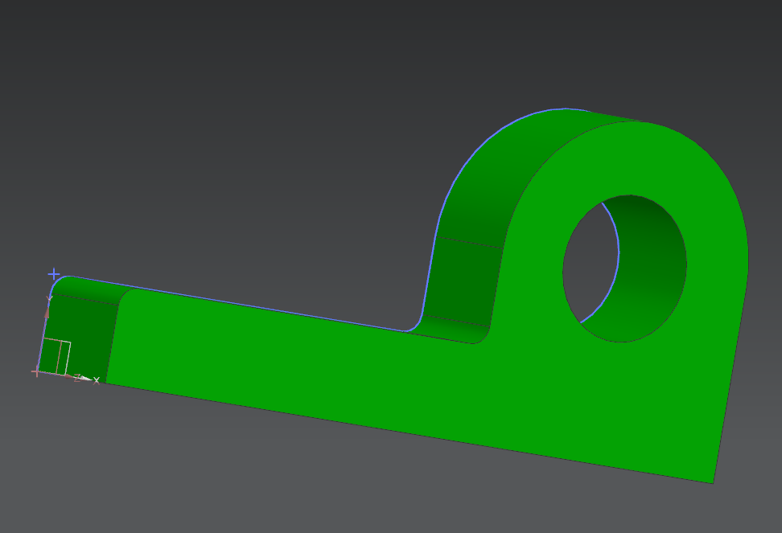
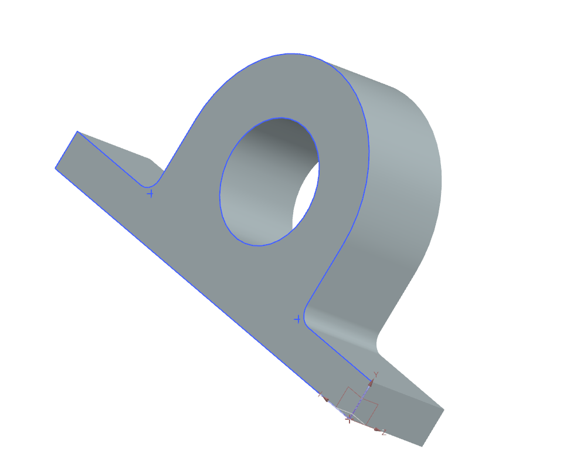
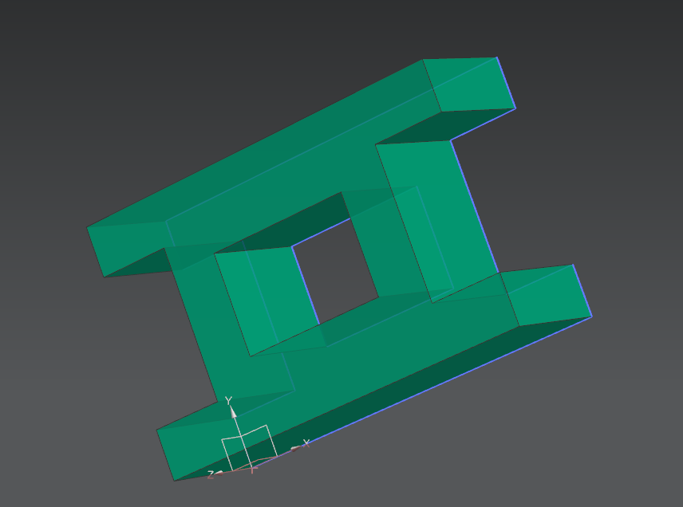
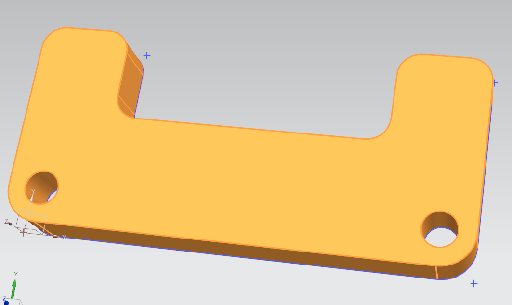

# NX12-For-Designers

## Daily NX12 Progress Log 

### Day 6: March 16 2021

Tutorial 3: Chapter 2

### Day 5: March 15 2021

Tutorial 2: Chapter 2 

### Day 4: March 14 2021 

Struggled with an overconstrained sketch. Spent way too long looking for the constraint causing the issue. Figured it out. 

### Day 3: March 13 2021

Misc Tutorial 

### Day 2: March 12 2021

Tutorial 3: Chapter 1 

Exercise 1: Chapter 1

Exercise 2: Chapter 1

### Day 1: March 11 2021 

Tutorial 1: Chapter 1

Tutorial 2: Chapter 1

