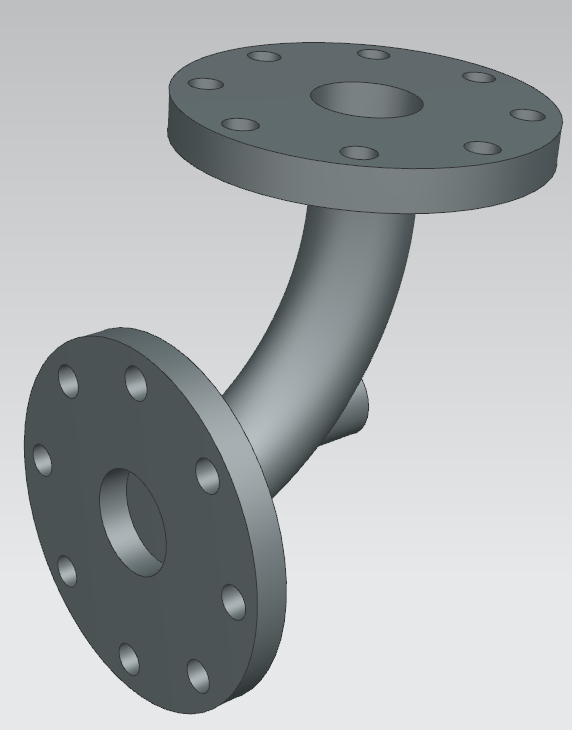
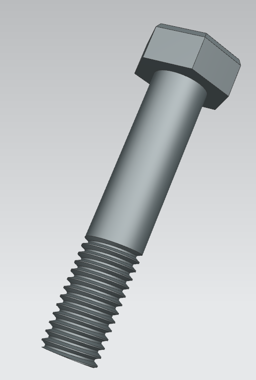
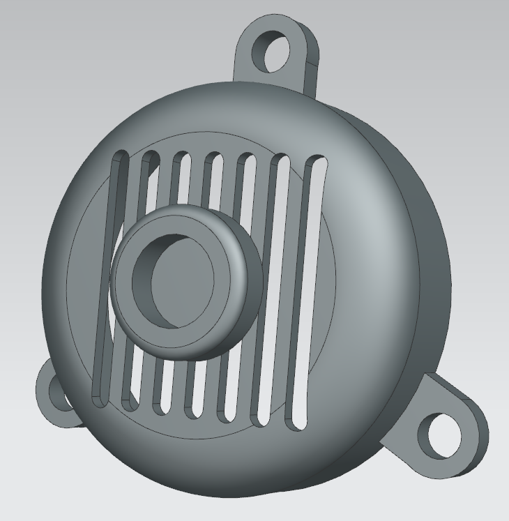
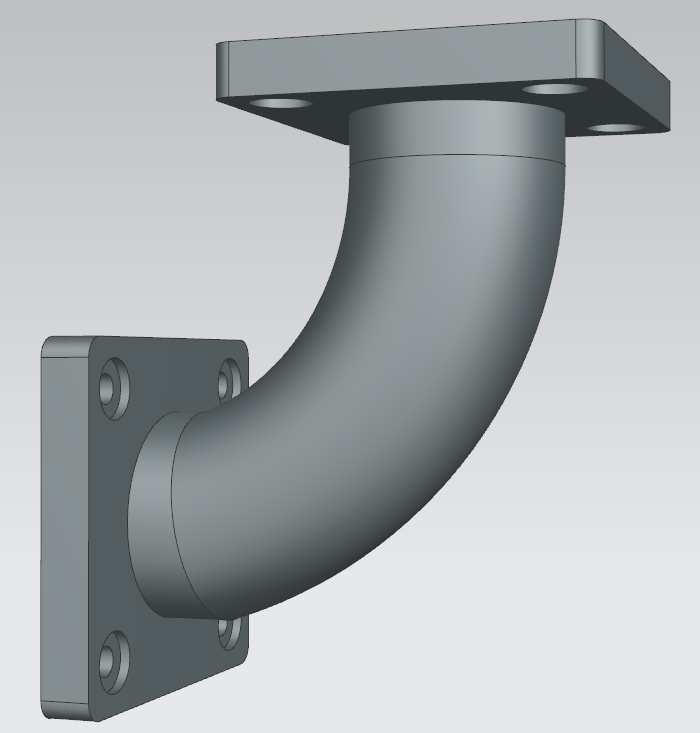
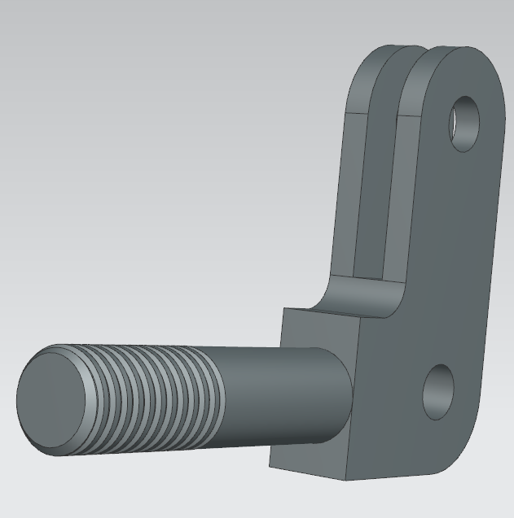
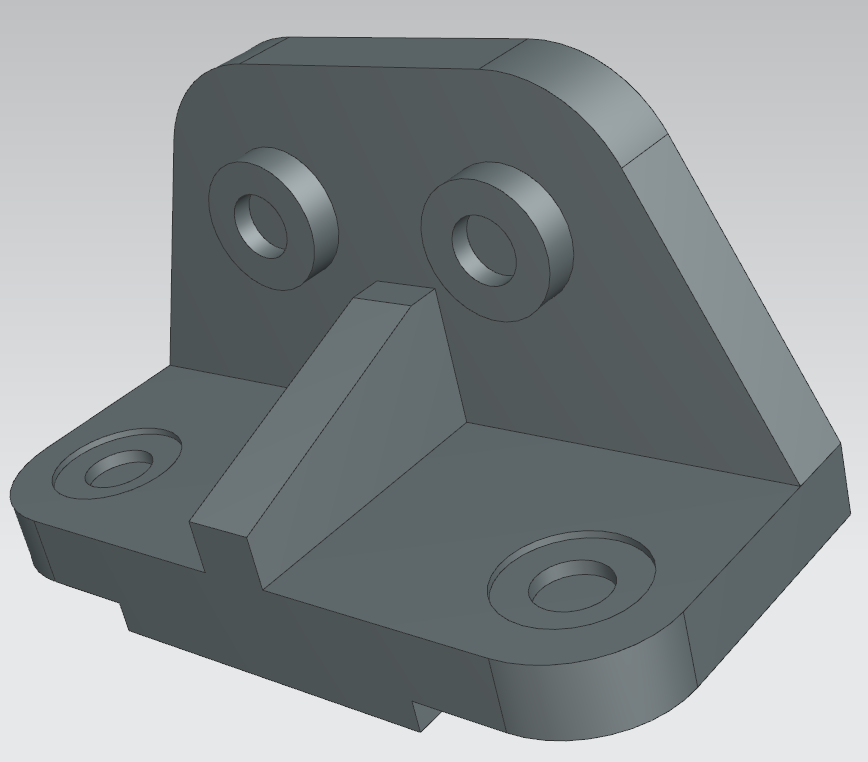
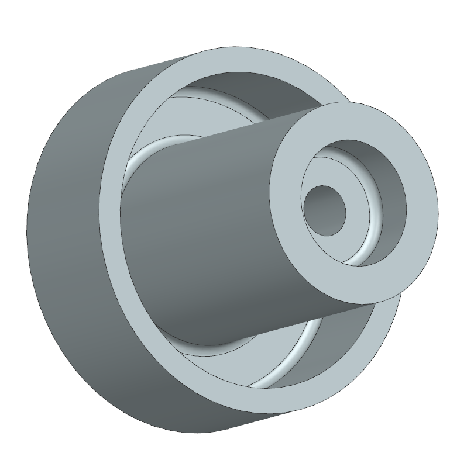

# NX12-For-Designers

## Daily NX12 Progress Log

### Day 20 March 31 2021 

Working on my first assembly! Modelled all components, just need to put them together now :)

### Day 19 March 30 2021 

Exercise 2: Chapter 6 

### Day 18 March 29 2021

Exercise 1: Chapter 6

### Day 17 March 28 2021 

Tutorial 4: Chapter 6

### Day 16: March 27 2021 

Tutorial 3: Chapter 6 

Tutorial 2: Chapter 6

### Day 14 + 15: March 25 - 26 2021

Tutorial 1: Chapter 6

### Day 13: March 24 2021

Tutorial 1: Chapter 6 [in progress]

Stuck on an edge blend, it always looks off from what the model should look like despite me following the instructions. I could just filet the sketch and then extrude it which makes the same result that I need but I want to follow the tutorial's steps. There's clearly something I'm doing wrong and I'm not sure what. Going to keep playing with it. 

### Day 12: March 23 2021

Exercise 3: Chapter 5 

Exercise 2: Chapter 5

### Day 12: March 22 2021

Stuck on Exercise 2, will keep working at it tomorrow.

### Day 11: March 21 2021

Exercise 1: Chapter 5

Tutorial 2: Chapter 5 

Tutorial 1: Chapter 5

### Day 10: March 20 2021

Exercise 3: Chapter 4

Exercise 2: Chapter 4

Exercise 1: Chapter 4 

### Day 9: March 19 2021

Tutorial 3: Chapter 4 

I struggled a lot with this tutorial and there are still several things that need to be fixed. I'm going to move on to the exercises and come back to this tutorial later. For now, it's complete. 

### Day 8: March 18 2021

Tutorial 3: Chapter 4 [in progress]

Struggling with creating a feature on an angled datum plane. The feature is not extruding on an incline despite the datum plane being at a 40 degree angle...I'll figure it out.   

### Day 7: March 17 2021

Tutorial 2: Chapter 4

Tutorial 1: Chapter 4

Exercise 2: Chapter 3

Tutorial 3: Chapter 3

Tutorial 2: Chapter 3 

Used my own dimensions for this one. 

### Day 6: March 16 2021

Tutorial 1: Chapter 3

Exercise 2: Chapter 2

Tutorial 3: Chapter 2

### Day 5: March 15 2021

Tutorial 2: Chapter 2 

### Day 4: March 14 2021 

Struggled with an overconstrained sketch. Spent way too long looking for the constraint causing the issue. Figured it out. 

### Day 3: March 13 2021

Misc Tutorial 

### Day 2: March 12 2021

Tutorial 3: Chapter 1 

Exercise 1: Chapter 1

Exercise 2: Chapter 1

### Day 1: March 11 2021 

Tutorial 1: Chapter 1

Tutorial 2: Chapter 1

